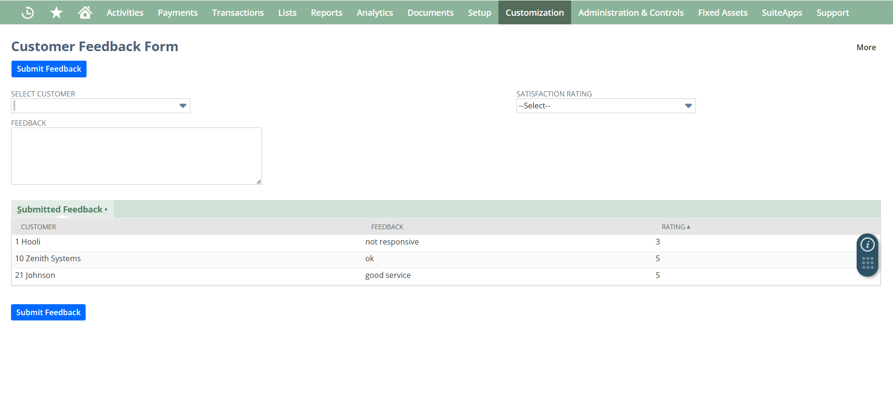
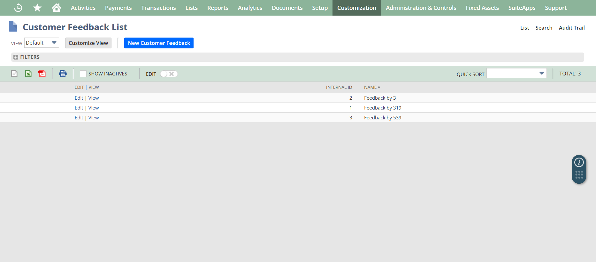

# 📊 NetSuite Customer Feedback Suitelet

A Suitelet built for Oracle NetSuite ERP to collect customer feedback internally and store it into custom records. Displays a real-time summary list of recent submissions inside the Suitelet form itself.

## 📦 Features
- Dynamic form with customer selector, feedback text, and star rating dropdown
- SuiteScript 2.1 (Suitelet)
- GET/POST handling for form submission
- Saves feedback into a custom record type
- Feedback list displayed live on form
- Clean, modular, documented code

## 💾 Technologies
- SuiteScript 2.1 (NetSuite)
- NetSuite Custom Records
- Sublist-based Feedback Summary

## 📸 Screenshots

| Feedback Form | Feedback Summary |
|:--------------|:----------------|
|  |  |

## 📖 Usage
1. Deploy `customerFeedbackSuitelet.js` as a Suitelet script in NetSuite.
2. Create a `Customer Feedback` custom record type with fields:
   - `custrecord_feedback_customer` (List/Record: Customer)
   - `custrecord_feedback_text` (Long Text)
   - `custrecord_feedback_rating` (Integer)
3. Deploy and test your Suitelet URL.

---

## 📣 Author
Anish Ananda Sagri
